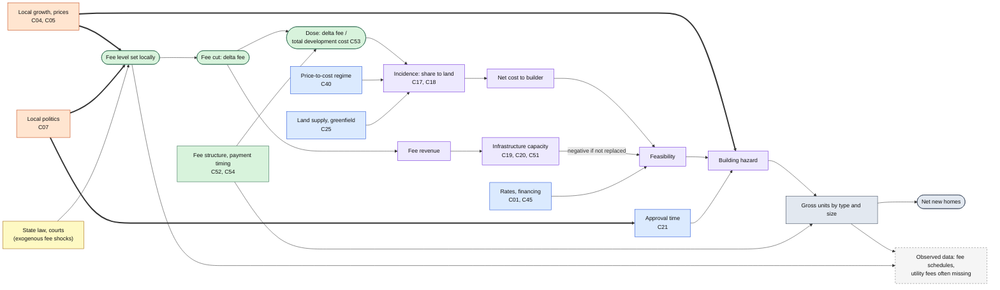

# Lotline: Causal diagram, development fee reduction (v0.1, 2026-10-04)

**Status:** working draft. This is the fees companion to `research/lotline-causal-diagram.md` (general framework, ADU diagram) and `research/lotline-causal-diagram-mm.md`.
**Register:** `research/lotline-confounder-register.csv`. Fees use 24 of the 54 factors. C50–C54 were added for this theme.
**Scenario (Handbook):** cut total development fees by 50% from an assumed **$50,000 per unit**, i.e. a **$25,000 per unit** cost reduction, across all fee categories.

---

## 0. Why fees need a different diagram

The ADU and Missing Middle diagrams are built around a **reform that some places adopt and others don't**. Fees don't work that way:

1. **Fee levels are continuous and set by the places themselves, usually because they are growing** (C50). In raw data, high fees sit next to high construction. That is the main reason the fee panels find nulls or even positive effects (E058, E059, E062).
2. **Clean fee cuts are rare.** The closest analogs are Florida's 2009–10 suspensions during the bust (E063) and Portland's 2010 ADU fee waiver, confounded by a size-limit change (E047).
3. **A fee cut has two paths with opposite signs.** It lowers cost (more building). It also lowers the revenue that pays for water, sewer and roads (possibly less building) (C51).
4. **Much of a fee cut may never reach the builder.** In strong markets it ends up in land prices (incidence, C18). Pass-through was ~$1.60 per $1 in Dade County (E064); 75% was absorbed in a weak Contra Costa submarket (E066).

So the causal question changes. We aren't asking "what did fee-cutting places get?" but two narrower questions:

- **How much does building respond to a cost change of this size?** (an elasticity, ε)
- **How much of the cost change reaches builders, rather than landowners?** (1 − λ, where λ is the land-capture share)

The forward model already has this form:

**%Δ permits = ε × (1 − λ) × (Δfee / total development cost) × ramp(t)**

Each term is a node in the diagram below.

---

## 1. Causal diagram

Thick arrows are back-door paths. Colors as in the other diagrams. A rendered copy is at `docs/research/lotline-causal-diagram-fees.png`.

**How to read it**

- **Growth → fee level** is the reverse-causality path (C50). Any comparison of high-fee and low-fee places, or of places before and after they raise fees, mixes it with the fee effect.
- **State law and courts (yellow)** change fees for reasons unrelated to local growth. These are the shocks we want for identification (§3).
- **Incidence** sits between the cut and the builder. It depends on the market regime and how easily land supply responds: where land is scarce and prices are well above cost, the cut goes to landowners.
- **Infrastructure** is the countervailing path. It is negative only if the revenue isn't replaced, so it is a toggle in the model, not a fixed effect.
- **Structure** also goes directly to the outcome: fees charged per unit push builders toward larger units, and size thresholds (California's 750 sq ft ADU exemption) should show up as **bunching** in unit sizes.

---

## 2. Adjustment, bad controls and modifiers

**Block:**

- Growth and prices → fee level (C50). Don't regress building on fee levels. Use fee changes caused by something outside local growth, or the pro forma.
- Politics → approval process (C07, C21). Fee changes often come with process changes; code both.

**Don't control for:**

- Post-cut land prices or house prices. They are the incidence channel (C17, C18).
- Infrastructure spending after the cut. It is the countervailing path we want to measure.

**Model as inputs:**

| Input | Range / basis |
|---|---|
| Dose: Δfee / total development cost (C53) | ≈5–7% single-family, 7–12% small multifamily, 10–15% ADU at a $25k cut |
| Land-capture share λ (C18) | 0.25–0.75, higher in strong markets (E064–E066, E068) |
| Elasticity ε | 0.5–3, central 1.5 (methods review §3c); tract-level unit elasticities ~0.3 (E081) argue for the low end locally |
| Revenue replaced? (C51) | Toggle |
| Payment timing (C54) | Carry cost in the pro forma |

**The Handbook's $50k is high almost everywhere we checked.** Real fees found: Raleigh ~$7.4k plus 0.38% of value, Charlotte ~$6.8k water and sewer, Austin ~$7.7k; only Colorado's 16-city study reached ~$51.7k. A $25k cut is larger than *total* actual fees in much of NC, TX and WI. We model the Handbook's number, show the dose against real fees side by side, and say so in the limitations.

---

## 3. Identification: where fee evidence can come from

| Source | Design | What it gives | Caveats |
|---|---|---|---|
| **NC: *Quality Built Homes v. Carthage* (2016)** | DiD: towns that lost water/sewer "future service" impact fees vs. places with local-act authority; reversed by the 2017 system-development-fee law (S.L. 2017-138) | A fee cut caused by a court, not local growth; an on–off design within NC | We need the list of affected towns and what they actually charged before and after. Some may have restructured fees quickly. To scout. |
| **CA SB 13 (2020)** | Bunching: ADUs just under 750 sq ft are fee-exempt | Size response to fees; an implied fee sensitivity | Needs ADU square footage (LA, SF permits; APR may not have it). Coincides with AB 68/AB 881. |
| **WA HB 1337 (2023)** | ADU impact fees capped at 50% of the main house's fee | Before/after across WA cities that charged ADU fees | Coincides with the rest of HB 1337 (two ADUs per lot) |
| **Portland SDC waiver (2010) and 2025 exemption** | Event study | Fee waiver effect on ADUs; temporary 2025 exemption tests pull-forward (C23) | 2010 confounded by size-limit change (E047); 2025 too recent for outcomes |
| **Any cost shock** (e.g., lumber 2021) | Elasticity of building to cost | ε, without needing a fee change | Cost shocks are national and temporary; fee cuts are local and permanent |
| **Incidence studies** | Hedonic price and land regressions | λ (E064, E066, E068) | Mostly 1990s–2000s Florida and California |
| **Pro forma threshold crossing** | Mechanism | How many parcels newly pencil when cost falls $25k | Only as good as the pro forma; validated separately (validation plan V2) |

**Recommended stance:** fees stay a mechanism-led scenario. The evidence prong reports literature bounds plus whatever the Carthage and SB 13 tests add. **The low case includes zero.**

---

## 4. Falsification checks specific to fees

| Check | Threat | Expected if the design is right |
|---|---|---|
| Building in Carthage-affected towns *before* 2016 vs. comparison places | Pre-existing divergence (C50) | Flat pre-trends |
| Land prices after a cut | Incidence (C18) | Rise in strong markets, little change in weak ones |
| Unit-size distribution around 750 sq ft before and after SB 13 | Fee structure (C52) | Bunching appears only after 2020 |
| Projects whose fees didn't change (e.g., commercial) | Concurrent shocks | No break |
| Places that cut fees without replacing revenue | Countervailing path (C51) | Smaller or zero effect than places that replaced it |

---

## 5. Open questions

- Which NC towns were affected by *Carthage*, and do permit series exist for them (BPS place-level, reported not imputed)?
- Do LA or SF ADU permits record square footage, for the SB 13 bunching test?
- Should the tool show results for the Handbook's $50k assumption **and** for each place's real fees? The second is more useful to a city; the first is what the Rules require.
