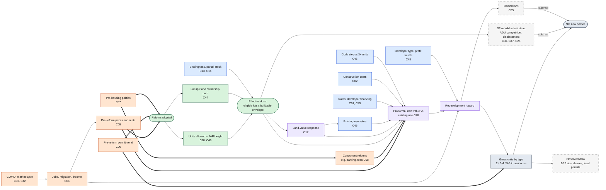

# Lotline: Causal diagram, Missing Middle (v0.1, 2026-10-04)

**Status:** working draft. This is the Missing Middle companion to `research/lotline-causal-diagram.md`, which holds the general framework and the ADU-focused diagram. Read that first; this file covers only what changes for 2–6 units on single-family lots.
**Register:** `research/lotline-confounder-register.csv`. Missing Middle uses 42 of the 54 factors. C43–C49 were added for this theme.

---

## 0. What is different from ADUs

| | ADUs | Missing Middle |
|---|---|---|
| Who builds | The homeowner, usually living on site | Small developers and infill builders |
| What happens to the existing house | Kept | Usually demolished, so teardown economics decide (C46) |
| How rates bite | Homeowner equity, cash, HELOCs (C22) | Construction loans, cap rates, sale prices (C45) |
| Ownership | One parcel, one owner | Townhouses need their own lots; plexes need condo law or stay rental (C44) |
| Code | Residential code | 3+ attached units usually move to the commercial code: sprinklers, accessibility, licensed design (C43) |
| Biggest substitution | Garages, additions, informal units (C30, C31) | The single-family rebuild that would have gone on the same lot (C30), and ADUs on the same lot (C47) |
| What Census BPS sees | ADUs mostly invisible | Townhouses count as **1-unit** permits; 5–6 unit buildings are mixed into **5+** with large apartments |

The last row matters for measurement. Census BPS can see duplexes, and 3–4 unit buildings as a group. It cannot separate townhouses from detached houses, or 5–6 plexes from apartment blocks. Local permit data is needed for both.

---

## 1. Causal diagram

Thick arrows are back-door paths to block. Colors:

- **orange:** confounders
- **green:** the treatment and its dose
- **blue:** effect modifiers
- **purple:** mediators (never control for them)
- **grey dashed:** measurement and gross-to-net adjustments

A rendered copy is at `docs/research/lotline-causal-diagram-mm.png`.

**How it differs from the ADU diagram**

- **Land value pushes in both directions.** A reform raises what a lot is worth for redevelopment (helping feasibility). It also raises the price of the house a developer has to buy and tear down, which hurts feasibility. Auckland's evidence shows both: a higher redevelopment premium, and intensively built sites losing value (E003).
- **The code step (C43) sits between zoning and feasibility.** Allowing six units does little if a triplex costs much more per unit than a duplex.
- **Demolitions come out of the same hazard that produces new units.** Net gain per project is units built minus one (Portland: 1.68 → 3.88 units per demolition, E022).

---

## 2. Adjustment, bad controls and modifiers

The back-door paths and the bad-controls rule are the same as in the general diagram (§3 there).

**Additions for Missing Middle:**

- **Concurrent reforms are common and specific.** Code these as separate components with their own dates:
  - Durham's 2023 parking reform (SCAD), four years after Expanding Housing Choices;
  - Raleigh's Missing Middle 2.0 (2022), one year after TC-5-20;
  - Seattle's MHA upzoning alongside its 2019 ADU reform.
- **Don't control for post-reform teardown sales or house prices.** Both move because of the reform (C17, C46).

**Modifiers the Missing Middle model needs**, in order of how much they move results:

1. Price-to-cost regime (C40), on a **for-sale townhouse** pro forma and a **rental plex** pro forma separately.
2. Existing-use value relative to land value (C46).
3. Envelope actually buildable: units × FAR × height (C49), and whether the old rules bound (C13).
4. Code step at 3+ units (C43).
5. Developer financing: construction-loan rate and cap rate (C45).
6. Lot-split path (C44).

---

## 3. Identification: how to estimate a Missing Middle effect

Ranked strongest first, with the candidates we have:

| Design | Why it works | Candidates | Caveats |
|---|---|---|---|
| **Within-city eligible vs. ineligible lots** (triple difference) | Cancels everything citywide: rates, demand, politics | **Raleigh TC-5-20 (2021)**: two-family homes allowed everywhere except **R-1**, so R-1 lots are an in-city comparison group. **Durham EHC (2019)**: applied in the urban tier, so suburban-tier lots compare. Auckland (E001) and São Paulo (E006) as models. | R-1 lots are larger and on the edge, so match on lot size and value (C14). Spillovers onto nearby ineligible lots. |
| **Synthetic control** for a whole city | Matches the pre-reform path | Durham, Raleigh vs. NC and Southeast places; Lower Hutt (E004) as model | Few donors with clean histories; donors must be checked against the policy inventory (C27) |
| **Staggered DiD** across reforming cities | Uses timing differences | Oregon HB 2001 cities (E024); Durham 2019, Raleigh 2021, Charlotte 2023 | Few cities; Charlotte has ~2 years post-reform |
| **Dose-response** | Stronger rules should produce more | Minneapolis (FAR bound) vs Portland vs Spokane (E019, E022, E025) | Cross-city, so many other differences |

**Outcome scale:** net new units per 1,000 eligible lots per year, split by type. Townhouses and 5–6 plexes need local permits, not BPS.

---

## 4. Falsification checks specific to Missing Middle

| Check | Threat | Expected if the design is right |
|---|---|---|
| Single-family permits on **ineligible** lots before and after | Citywide shock (C04, C07) | No break at the reform date |
| Large apartment (20+ unit) permits | Citywide demand | No break at the reform date |
| Single-family rebuilds on **eligible** lots | Substitution (C30) | A fall is cannibalization; record it rather than treat it as noise |
| Triplex/fourplex share vs. duplex share | Code step (C43) | Response concentrated in duplexes and townhouses |
| Leads in event study | Selection, anticipation (C05, C29) | Flat |
| Permits on non-single-family land in the same city | Leakage (E016: Houston townhouses mostly on non-SF land) | Reported separately; not counted as reform effect |

---

## 5. Open questions

- Does North Carolina (or the chosen state) let small multifamily use the residential code? This decides C43 for the target.
- Can Raleigh and Durham permits separate townhouses from detached houses? If not, townhouses can be identified from parcel splits and year built.
- What FAR do we assume for the benchmark? The Handbook gives 3 stories and frees setbacks and coverage. A stated FAR sensitivity is the honest answer.
