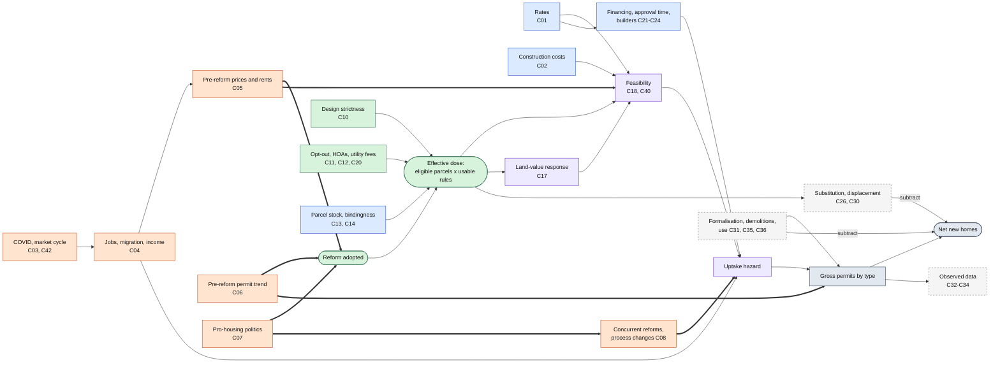

# Lotline: Causal diagram and confounder register (v0.1, 2026-10-03)

**Status:** working draft. It sits alongside `research/lotline-statistical-protocol.md` and proposes changes to it in §7.
**Theme diagrams:** this file holds the general framework and the ADU diagram. Missing Middle is in `research/lotline-causal-diagram-mm.md` and fees in `research/lotline-causal-diagram-fees.md` (added 2026-10-04).
**Companion file:** `research/lotline-confounder-register.csv`, which had 42 factors at v0.1 and now has 54 (C43–C54 added for Missing Middle and fees). Each row gives:

- the factor's role;
- how it biases an estimate;
- how the design handles it;
- how the forward model handles it;
- data sources;
- evidence IDs.

IDs C01–C42 below refer to that file. E-numbers refer to `research/lotline-evidence-register.csv`.

**Sources reviewed for this pass:**

- `lotline-methods-extraction.csv` (42 studies + 4 guidance papers);
- `lotline-methods-review.md`;
- `lotline-evidence-register.csv` (104 entries);
- `adu-study-design.md`;
- `podcast-upzoned-301-notes.md`.

---

## 0. Summary

1. **Most factors play one of three roles, and each role needs a different fix.**
   - **Confounders** fake or hide an effect. Fix them through the comparison design.
   - **Effect modifiers** change the real size of the effect. Model them explicitly as inputs.
   - **Mediators** carry the effect. Never control for them.
2. **Interest rates are mainly a modifier, not a confounder.**
   - Rates are national, so the year effects in any comparison design cancel their level.
   - What remains is that the same reform yields less at 7% than at 3%. That interaction belongs inside the model.
3. **The largest confounder is which places choose to reform** (C05–C07). Places reform under price pressure and pro-housing politics, and both raise construction on their own.
   - The fix is matching on the pre-reform *path*.
   - Better still, compare eligible with ineligible parcels inside the same place (§4).
4. **The research review added 28 factors to the 14 we discussed** (§6). The most consequential:
   - local opt-out and implementation (C11);
   - how binding the old rules were (C13);
   - parcel stock and teardown cost (C14);
   - land-value capitalization as a mediator we must not control for (C17);
   - approval time (C21);
   - homeowner financing as the channel through which rates hit ADUs (C22);
   - **measurement starting at the reform itself** (C32).

---

## 1. What we are estimating

Policy effect = homes built with the reform − homes that would have been built without it. The second term is never observed; every method below is a way to estimate it.

The forward model answers three questions in sequence:

| Question | Model piece | Main threats |
|---|---|---|
| What would have been built anyway? | Baseline forecast | C01–C06, C42 |
| How much reform actually applies here? | Effective dose (eligible parcels × usable rules) | C08–C14, C20 |
| How much of the extra building is truly new? | Net-new share | C26, C30–C36 |

**Projected net new homes = baseline + (eligible parcels × uptake hazard(dose, feasibility, modifiers) × units per project) × net-new share**

---

## 2. Causal diagram

Thick arrows are the **confounding (back-door) paths** the design must block. Colors:

- **orange:** confounders (handle through the design)
- **green:** the treatment and its dose
- **blue:** effect modifiers (model them)
- **purple:** mediators (never control for them)
- **grey dashed:** measurement and gross-to-net adjustments

A rendered copy is at `docs/research/lotline-causal-diagram.png`.

**How to read it**

- Every thick arrow into **Reform adopted** opens a back-door path. For example: prices → reform, and prices → feasibility → building. A raw comparison of reformers and non-reformers mixes that path with the policy effect.
- **Rates and costs** only point into feasibility and financing. They do not point into reform adoption.
  - For a sample of places facing the same national rates, that makes them modifiers, not confounders.
  - The exception is a before/after study of one place. There, time itself is the comparison, so anything that changes over time confounds.
- **Land value, feasibility and hazard** sit *between* the reform and the outcome. They are how the reform works, so controlling for them removes the effect we want to measure.
- **Observed data** is a separate node because the counting system can change at the reform (C32). The jump we see is then partly a change in counting.

---

## 3. What to adjust for, what to model, what to leave alone

### 3a. Block these back-door paths (estimating effects from comparable places)

| Path | Block with |
|---|---|
| Common national shocks (C01–C03, C42) | Year fixed effects or the synthetic-control comparison itself. Never use a single place's own pre-period alone. |
| Price pressure → adoption (C05) | Match or synthetic control on the pre-reform price level and path; event-study leads; HonestDiD bounds |
| Permit momentum (C06) | Match on demeaned pre-period outcomes (Ferman–Pinto SC, as in E002/E004) |
| Local demand (C04) | Shift-share employment index from **pre-period** industry mix (E081); pre-period covariates only |
| Politics → package of reforms (C07, C08) | Code the whole reform bundle with dates. Use the within-place eligible-vs-ineligible contrast (§4). Report a package effect when the parts can't be separated. |

### 3b. Do not control for these (bad controls)

- **Post-reform** land values, house prices or rents (C17). The reform moves them.
- **Post-reform** population or household growth. New homes attract people.
- Feasibility or redevelopment counts measured after the reform.
- Anything else the reform could change. The rule (Stuart 2010, G02; Roth et al. 2023, G03): covariates are measured before treatment.

### 3c. Model these as inputs (effect modifiers)

The forward model needs these. They are also the covariates for transporting effects from comparables to the target state.

| Modifier | Why it matters | Model input |
|---|---|---|
| Price-to-cost regime (C40) | Decides whether a reform or fee cut builds homes or raises land values | Feasibility; fee incidence λ |
| Rates (C01) and financing access (C22) | Developers' pro forma for missing middle; owners' equity and cash for ADUs | Rate slider; separate ADU and MM hazards |
| Bindingness of old rules (C13) | No effect where the old rule wasn't the constraint | Dose |
| Parcel stock (C14) | Teardown cost and room for an ADU | Parcel hazard multipliers |
| Design strictness and implementation (C10, C11) | Separates a law on paper from a law that is used | Dose; effective-adoption share |
| Approval time (C21) | Delay mattered more than fees in the metro panel (E058) | Local-lever slider |
| Builder learning (C24) | Uptake keeps rising for years | Ramp shape |

---

## 4. The strongest design move: compare within the same place

The design that removes the most threats at once compares parcels the reform made eligible with similar parcels it didn't, **inside the same city and years** (a triple difference).

- **What it cancels:** everything citywide, including rates, local demand, politics, citywide fee or process changes, and the market cycle (C01–C05, C07, C42).
- **Literature precedents:**
  - single-family vs 2–3-family zones in LA, San Diego and San Francisco (E041);
  - eligible share × post-2017 in LA (E042);
  - block boundaries in São Paulo (E006);
  - upzoned vs non-upzoned land within the same suburb in Auckland (E001).
- **Where eligibility comes from under statewide ADU laws** (when every single-family parcel is nominally eligible): physical thresholds such as buildable area net of setbacks (E042 uses ≥800 sq ft), lot size, alley access, or fire-zone exclusions.

**Limits to state openly:**

- Spillovers onto ineligible parcels (E042 finds effects within 300 m).
- Ineligible parcels can differ in ways that matter, such as lot size. Match on parcel stock (C14) to address this.

---

## 5. Falsification checks, mapped to threats

| Check | Threat tested | Precedent |
|---|---|---|
| Event-study leads flat; placebo reform dates 2–3 years earlier | C05, C06, C29 | E001, E002, E004, E012 |
| Placebo outcome: building types the reform didn't touch (e.g., 5+ unit permits after an ADU law) | C04, C07 | E006 (single-family placebo null) |
| Placebo-in-space permutation (rank of post/pre RMSE ratio) | All single-place threats | E002, E004, E021 |
| Population-growth synthetic control | C03 (COVID in-migration) | E004 |
| Re-run excluding 2020–21 | C03 | — |
| Synthetic controls on neighbors | C26 | E002, E004 |
| Donor-pool audit against the policy inventory | C27 | E013, E021 |
| Effect by building type and on total | C30 | E001, E006, E022 |
| Pre-period series consistency check at the reform date | C32 | E038 |
| Dose-response: stronger reform → bigger effect (CA 2017 vs 2020; Minneapolis vs Portland) | C10, C11 | E019, E024 |

---

## 6. What the research review added

These factors were not in the 2026-10-03 conversation. Each is marked `research review` in the register.

**Policy and treatment definition**

- **C11 Local opt-out and implementation.**
  - 68% of Connecticut towns opted out (E057).
  - Pre-2017 California local ordinances blunted state law (E053).
  - SB 9 projects faced lien releases, $30–50k lot-split fees and $50–100k utility fees (E028).
  - *A state law is not the treatment; local uptake of the law is.*
- **C09 Sequential reforms and mis-dating.** Duplicates and iterative reforms get credited to the first one (E013).
- **C07 Pro-housing politics** as the unobserved common cause of reform bundles.
- **C12 HOAs and private covenants.** A hidden constraint that zoning data can't see (E037, E038).

**Parcel and feasibility**

- **C13 Bindingness.** Zurich effects appear only where zoning bound (E007). Most Houston townhouses went on land that wasn't single-family (E016).
- **C14 Parcel stock.** Covers improvement-to-land value, lot size, house age and garages (E003, E010, E034, E040).
- **C15 Owner-occupancy and household composition** (E026, E040).
- **C17 Land-value capitalization is a mediator.** Controlling for post-reform prices biases the estimate (E003, E011, E017, E018).
- **C18–C19 Fee incidence and what fees buy.** Water/sewer fees and other fees work in opposite directions (E059, E060).

**Process**

- **C21 Approval time.** A 1-SD longer delay (about 2–3 months) meant 20–25% fewer permits (E058). Pre-approval adds 8–12 pp to 4-year completion (E076).
- **C22 Homeowner financing.** Portland ADUs were 62% cash-financed with 2% construction loans. *This is how rates reach ADUs, and it differs from the developer channel for missing middle.*
- **C23 Price uncertainty and option value** (E079). Also: temporary fee cuts pull projects forward.
- **C24 Builder learning and diffusion.** Portland kept rising for about 6 years.
- **C25 Greenfield availability.** It shapes displacement (E001, E080).

**Design and measurement**

- **C27 Control contamination.** Statewide laws leave no in-state controls. A third of the Minneapolis Fed's donor cities later reformed (E021).
- **C28 Size mismatch.** Reformers averaged about 200k residents, controls about 20k (E012).
- **C32 Measurement change at the reform.** California's parcel-level ADU data (APR) begins in 2018, right after the 2017 law. Earlier counts cover only the largest cities (E038). *Part of the famous "15–20×" jump may be a new counting system.*
- **C33–C35** BPS imputation, permits vs completions, demolitions.

**Lower priority:** C16 location and access; C37 property-tax regime; C38 hazard zones and disaster rebuilds; C41 neighbor backlash.

---

## 7. Proposed changes to the statistical protocol

1. **§5.4 coding rubric.** Add these fields:
   - local opt-out or implementation status (C11);
   - utility and lot-split fees (C11, C20);
   - median approval days before and after (C21);
   - pre-approved plans (yes/no);
   - HOA share where known (C12);
   - a flag for a data-regime break at the reform (C32).
2. **§5.5 similarity covariates.** With ~15 comparables we can use 3–4 effect modifiers. Proposed priority order:
   1. price-to-cost ratio (C40);
   2. bindingness of the old rules (C13);
   3. pre-reform permit rate per 1,000 eligible parcels (C06);
   4. homeowner equity / financing proxy (C22, for ADUs only).

   Lot size moves into parcel-level hazard multipliers (C14) instead of the place-level distance.
3. **§5.6 design.** Add the within-place eligible-vs-ineligible contrast (§4) as the preferred design where parcel data allow. Fall back to SC/staggered DiD otherwise.
4. **§5.10 gross to net.** Add the data-regime-break adjustment (C32) alongside the formalization share.
5. **New §5.11: bad-controls rule.** No post-reform prices, rents, land values or population on the right-hand side of any estimate (C17).
6. **Forward model.** Use separate rate channels: a developer pro forma for missing middle and an owner-equity hazard for ADUs (C22).

---

## 8. Open questions

- Which state? Several factors depend on it: whether HOA data exist (C12), whether permits record application dates (C21), and whether local ADU flags exist (C32).
- Can the ADU natural experiment (`adu-study-design.md`) find an eligibility threshold inside California cities to run the §4 contrast? Candidates: buildable area, alley access, fire zones.
- How much of California's 2017–19 ADU jump survives once the pre-2018 data are rebuilt consistently (C32)? This one check could move the ADU calibration a lot.
