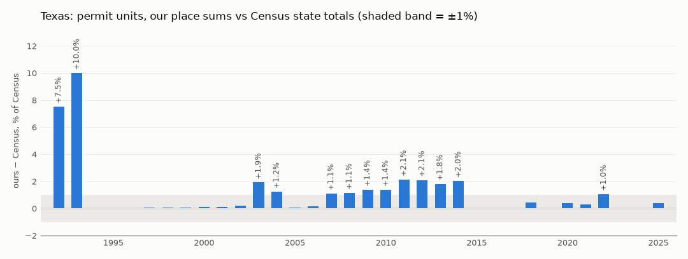

# V0 national data check: Texas

<!-- GENERATED by `lotline validate --state TX --step V0`. Do not edit. -->

- **Generated:** 2026-10-06 · schemas 1.3
- **Data:** as pulled into `LOTLINE_DATA_DIR`; sources and dates in `docs/data_provenance.md`
- **Held-out years not compared:** none (no holdouts)
- **Result *(rule: every compared year within 1%)*:** **GAPS TO EXPLAIN**: 21 of 34 years within 1%; 6 match exactly

## 1. BPS place files add up to Census state totals

Units in new privately owned residential buildings, with Census imputation. `diff` = ours − Census. Census revises state totals after the annual survey (late reports, corrections), so small gaps are expected.

| year | ours | census | diff | diff_pct | diff_1 | diff_2 | diff_3_4 | diff_5p | status |
|---|---|---|---|---|---|---|---|---|---|
| 1992 | 69,057 | 64,235 | 4,822 | +7.51% | 4,745 | 4 | 45 | 28 | gap |
| 1993 | 85,509 | 77,754 | 7,755 | +9.97% | 7,292 | 92 | 20 | 351 | gap |
| 1994 | 102,592 | 102,580 | 12 | +0.01% | 10 | 2 | 0 | 0 | within 1% |
| 1995 | 105,105 | 105,102 | 3 | +0.00% | 3 | 0 | 0 | 0 | within 1% |
| 1996 | 118,852 | 118,823 | 29 | +0.02% | 29 | 0 | 0 | 0 | within 1% |
| 1997 | 126,022 | 125,974 | 48 | +0.04% | 48 | 0 | 0 | 0 | within 1% |
| 1998 | 156,830 | 156,729 | 101 | +0.06% | 81 | 4 | 0 | 16 | within 1% |
| 1999 | 146,644 | 146,564 | 80 | +0.05% | 80 | 0 | 0 | 0 | within 1% |
| 2000 | 141,402 | 141,231 | 171 | +0.12% | 169 | 2 | 0 | 0 | within 1% |
| 2001 | 150,466 | 150,342 | 124 | +0.08% | 124 | 0 | 0 | 0 | within 1% |
| 2002 | 165,322 | 165,027 | 295 | +0.18% | 290 | 2 | 3 | 0 | within 1% |
| 2003 | 180,574 | 177,194 | 3,380 | +1.91% | 3,296 | 2 | 0 | 82 | gap |
| 2004 | 191,140 | 188,842 | 2,298 | +1.22% | 2,288 | 0 | 4 | 6 | gap |
| 2005 | 210,726 | 210,611 | 115 | +0.05% | 115 | 0 | 0 | 0 | within 1% |
| 2006 | 216,926 | 216,642 | 284 | +0.13% | 282 | 2 | 0 | 0 | within 1% |
| 2007 | 178,908 | 176,992 | 1,916 | +1.08% | 1,911 | 2 | 3 | 0 | gap |
| 2008 | 131,004 | 129,523 | 1,481 | +1.14% | 1,481 | 0 | 0 | 0 | gap |
| 2009 | 85,605 | 84,440 | 1,165 | +1.38% | 1,161 | 4 | 0 | 0 | gap |
| 2010 | 89,674 | 88,461 | 1,213 | +1.37% | 1,197 | 8 | 8 | 0 | gap |
| 2011 | 99,514 | 97,450 | 2,064 | +2.12% | 1,748 | 0 | 4 | 312 | gap |
| 2012 | 138,332 | 135,514 | 2,818 | +2.08% | 2,394 | 0 | 8 | 416 | gap |
| 2013 | 150,122 | 147,460 | 2,662 | +1.81% | 2,646 | 16 | 0 | 0 | gap |
| 2014 | 170,364 | 166,982 | 3,382 | +2.03% | 3,344 | 6 | 0 | 32 | gap |
| 2015 | 175,443 | 175,443 | 0 | +0.00% | 0 | 0 | 0 | 0 | match |
| 2016 | 165,853 | 165,853 | 0 | +0.00% | 0 | 0 | 0 | 0 | match |
| 2017 | 175,112 | 175,112 | 0 | +0.00% | 0 | 0 | 0 | 0 | match |
| 2018 | 193,703 | 192,878 | 825 | +0.43% | 825 | 0 | 0 | 0 | within 1% |
| 2019 | 209,895 | 209,895 | 0 | +0.00% | 0 | 0 | 0 | 0 | match |
| 2020 | 231,338 | 230,503 | 835 | +0.36% | 824 | 8 | 3 | 0 | within 1% |
| 2021 | 266,748 | 265,955 | 793 | +0.30% | 709 | 74 | 0 | 10 | within 1% |
| 2022 | 265,752 | 263,007 | 2,745 | +1.04% | 2,697 | 24 | 24 | 0 | gap |
| 2023 | 232,373 | 232,373 | 0 | +0.00% | 0 | 0 | 0 | 0 | match |
| 2024 | 225,756 | 225,756 | 0 | +0.00% | 0 | 0 | 0 | 0 | match |
| 2025 | 211,072 | 210,217 | 855 | +0.41% | 612 | 0 | 0 | 243 | within 1% |

## 2. Permits tied to a jurisdiction

| period | units | unattributed | imputed by Census | place-years flagged imputed |
|---|---|---|---|---|
| 1992–2008 | 2,477,079 | 0.07% | 4.92% | 18.87% |
| 2009 on | 3,086,656 | 0.00% | 5.93% | 19.71% |

## 3. Coverage of processed tables

- `bps_place_year`: 30,507 rows · 1992–2025 · 1,045 geographies · nulls: `geoid` 0.81%

- `jurisdictions`: 1,011 rows; kinds {'place': 957, 'county_unincorporated': 54}

- `market_geo_year`: 154,795 rows · 1947–2026 · 4,781 geographies · nulls: `hpi` 6.86%, `hpi_base2000` 25.40%, `hpi_change_pct` 11.52%

- `acs_geo_year`: 3,142,871 rows · 2010–2024 · 10,512 geographies · nulls: `estimate` 0.57%, `moe` 0.59%

## 4. Gaps later steps must handle

- FHFA county house price index: 179 of 254 counties
- FHFA county-years without an index: 0.52%
- FHFA zip5-years without an index: 1.60%
- FHFA tract-years without an index: 9.04%
- ACS county estimates suppressed: 0.05%
- ACS place estimates suppressed: 1.48%
- ACS state estimates suppressed: 0.00%
- ACS tract estimates suppressed: 0.31%

## 5. Licenses

- `census_acs5`: Public domain (U.S. Government work, 17 U.S.C. §105)
- `census_bps_place_annual`: Public domain (U.S. Government work, 17 U.S.C. §105)
- `census_bps_state_annual`: Public domain (U.S. Government work, 17 U.S.C. §105)
- `census_dec_pl`: Public domain (U.S. Government work, 17 U.S.C. §105)
- `fhfa_hpi_annual`: Public domain (U.S. Government work, 17 U.S.C. §105)
- `fred`: Freddie Mac PMMS, republished by FRED with permission; attribution required
- `fred`: Public domain (BLS, U.S. Government work)

## Years outside 1% (to explain)

| year | ours | census | diff | diff_pct | diff_1 | diff_2 | diff_3_4 | diff_5p | status |
|---|---|---|---|---|---|---|---|---|---|
| 1992 | 69,057 | 64,235 | 4,822 | +7.51% | 4,745 | 4 | 45 | 28 | gap |
| 1993 | 85,509 | 77,754 | 7,755 | +9.97% | 7,292 | 92 | 20 | 351 | gap |
| 2003 | 180,574 | 177,194 | 3,380 | +1.91% | 3,296 | 2 | 0 | 82 | gap |
| 2004 | 191,140 | 188,842 | 2,298 | +1.22% | 2,288 | 0 | 4 | 6 | gap |
| 2007 | 178,908 | 176,992 | 1,916 | +1.08% | 1,911 | 2 | 3 | 0 | gap |
| 2008 | 131,004 | 129,523 | 1,481 | +1.14% | 1,481 | 0 | 0 | 0 | gap |
| 2009 | 85,605 | 84,440 | 1,165 | +1.38% | 1,161 | 4 | 0 | 0 | gap |
| 2010 | 89,674 | 88,461 | 1,213 | +1.37% | 1,197 | 8 | 8 | 0 | gap |
| 2011 | 99,514 | 97,450 | 2,064 | +2.12% | 1,748 | 0 | 4 | 312 | gap |
| 2012 | 138,332 | 135,514 | 2,818 | +2.08% | 2,394 | 0 | 8 | 416 | gap |
| 2013 | 150,122 | 147,460 | 2,662 | +1.81% | 2,646 | 16 | 0 | 0 | gap |
| 2014 | 170,364 | 166,982 | 3,382 | +2.03% | 3,344 | 6 | 0 | 32 | gap |
| 2022 | 265,752 | 263,007 | 2,745 | +1.04% | 2,697 | 24 | 24 | 0 | gap |
